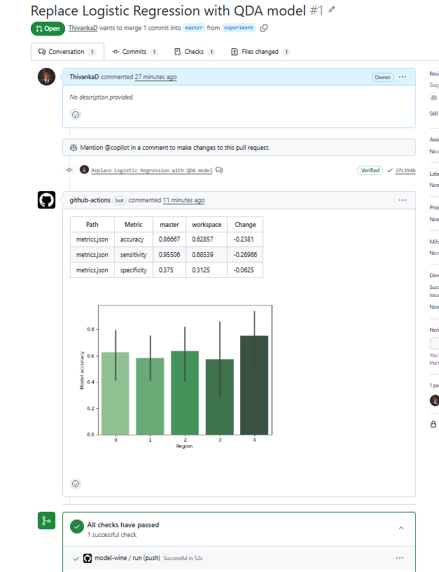

[](https://github.com/ThivankaD/Farmers/actions/workflows/train.yaml)
[](https://dvc.org/)
[](https://cml.dev/)


## Project Overview

This repository implements a  MLOps pipeline for modeling Swiss farmers' attitudes about climate change, using the dataset from [Kreft et al. 2020](https://www.sciencedirect.com/science/article/pii/S2352340920303048).

The goal is to show an end‑to‑end, reproducible workflow:

- Fetch raw survey data from a remote source
- Process and clean the data
- Train a machine‑learning model
- Track data, models, and metrics with DVC
- Automate training and reporting with GitHub Actions + CML

## Architecture

At a high level, the MLOps architecture has three layers:

1. **Data & Model Pipeline (DVC)**  
	- `get_data.py`: downloads the raw CSV (`data_raw.csv`) from ETH Zurich research collection.  
	- `process_data.py`: cleans/transforms `data_raw.csv` into `data_processed.csv`.  
	- `train.py`: trains a logistic regression model on `data_processed.csv`, writes metrics to `metrics.json`, and saves a diagnostic plot `by_region.png`.

	These steps are defined as DVC stages in `dvc.yaml` and tracked in `dvc.lock`:

	- **Stage `get_data`** → produces `data_raw.csv`
	- **Stage `process`** → produces `data_processed.csv`
	- **Stage `train`** → produces `metrics.json` and `by_region.png`

2. **Experiment Tracking & Versioning (Git + DVC)**  
	- Git tracks the code, configuration, and DVC metadata (`dvc.yaml`, `dvc.lock`).  
	- DVC tracks data and model artifacts (e.g. `data_raw.csv`, `data_processed.csv`, `by_region.png`, `metrics.json`).  
	- Each commit represents a versioned experiment; you can compare metrics across commits using `dvc metrics diff`.

3. **CI/CD & Reporting (GitHub Actions + CML)**  
	- `.github/workflows/train.yaml` defines an automated workflow that runs on each push:  
	  - Sets up a container image with DVC and CML.  
	  - Installs Python dependencies from `requirements.txt`.  
	  - Runs the full DVC pipeline with `dvc repro`.  
	  - Computes a metrics comparison vs `master` with `dvc metrics diff --md master > report.md`.  
	  - Appends the `by_region.png` plot to `report.md` and posts it as a GitHub comment using `cml comment create`.  
	- This gives you automated feedback on model performance and a visual check of performance by region directly in GitHub.

## Local Development Workflow

1. **Create and activate a virtual environment** (Windows PowerShell example):

	```powershell
	python -m venv .venv
	.\.venv\Scripts\activate
	```

2. **Install dependencies**:

	```powershell
	pip install -r requirements.txt
	```

3. **Initialize DVC (once per repo)**:

	```powershell
	dvc init
	```

4. **Reproduce the full pipeline** (data → process → train):

	```powershell
	dvc repro
	```

	This will run `get_data.py`, `process_data.py`, and `train.py` in order and update `dvc.lock` and the outputs.

5. **Inspect outputs**:

	- `data_raw.csv`: downloaded raw survey data.  
	- `data_processed.csv`: cleaned and feature‑engineered dataset.  
	- `metrics.json`: accuracy, specificity, sensitivity of the model.  
	- `by_region.png`: bar plot of model accuracy by region.

6. **Track and share results**:

	```powershell
	git add .
	git commit -m "Run pipeline and update metrics"
	git push origin <branch>
	```

	After pushing, GitHub Actions will run the same pipeline and leave a comment with updated metrics and the `by_region.png` figure.

## Key Files

- `get_data.py` – downloads the raw data CSV from ETH Zurich.  
- `process_data.py` – data preprocessing and feature engineering.  
- `train.py` – model training, metric computation, and plotting.  
- `dvc.yaml` – DVC pipeline definition (stages and dependencies).  
- `dvc.lock` – exact, reproducible versions of data and code for each stage.  
- `.github/workflows/train.yaml` – CI workflow (DVC + CML integration).  
- `requirements.txt` – Python dependencies.

## Results

